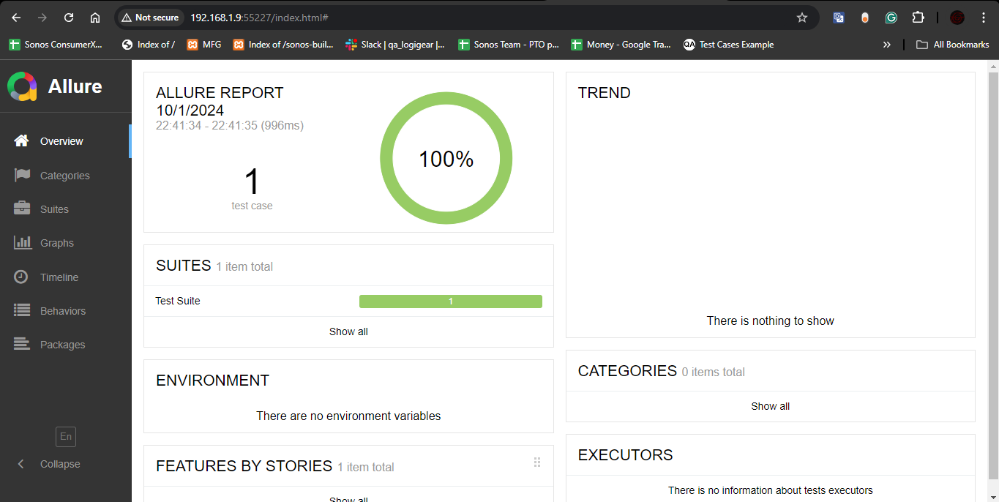

## TA-DASHBOARD AUTOMATION REPOSITORY

## Summary
This repository is used to test the [Dashboard](http://localhost:54000/TADashboard/login.jsp) website

## Prerequisites

### Application
IntelliJ IDEA Community Edition (download here: https://www.jetbrains.com/idea/download/?section=windows)
+ Should be used because this is the application that wrote this repository
+ Other IDEAs can be used, but installation and usage will be slightly different

### Environments
+ Java 17 (download here: https://www.java.com/download/ie_manual.jsp)
+ Maven (visit here: https://mvnrepository.com/)
+ TestNG (visit here: https://mvnrepository.com/artifact/org.testng/testng)
+ Selenide (download here: https://selenide.org/2024/09/15/selenide-7.5.0/)

## How to run the code
1. Download source code (location, unzip,...)
2. Open IntelliJ IDEA. ```File``` -> ```Open``` -> ```Select file``` -> ```New Window``` or ```This Window```
3. Wait for dependencies to be installed (reimport if needed)
4. Make sure that at least the following plugins are imported: ```testNG```, ```lombok```
5. Make sure the browser is on the correct version (updated if the version is too old)
6. Run tests by commandline or using UI

### Run tests with Maven from the Command Line
- Run all TCs: 
```mvn test```

- Run tests with 'testng.xml' file: 
```mvn clean test```

- Run a specific class: 
```mvn -Dtest=SampleTest test```

- Run a method in a class: 
```mvn -Dtest=SampleTest#methodName test```

- Run with custom profile: 
```mvn test -PprofileName```

## How to get the results
1. Run tests by commandline or using UI
2. After running the program, point to the current project 
(e.g. E:\Logigear\SELENIUM 2\TranAnh_Sele2_Aug\AnhTran_TAdashboard_Aug>)
3. Enter '''allure serve allure-results''' into the Terminal and then press Enter
4. You should see the results like this:

   
5. You can visit the result website to get more information

## How to run Selenium Grid
1. Create hub: enter the following string in the first cmd
```java -jar selenium-server-4.25.0.jar hub```
2. Create node(s): enter the following string in the second cmd or more
```java -jar selenium-server-4.25.0.jar node  --selenium-manager true```
3. Enter to localhost: 
```http://localhost:4444/ui/#``` (default)
   
4. Run test cases as usual and observe the localhost site

## Project Structure
**\src\main\java\auto: contain constructor, pages
**\src\test\java\auto: contain test cases
**\src\main\resources: contain data, config file

### The features are applied
+ Github: Gitflow
+ Configuration: pom.xml: Dependencies, Commandline
+ Code: Name convention, OOP, Json, Data driven
+ Report: Allure report
+ Parallel / Grid